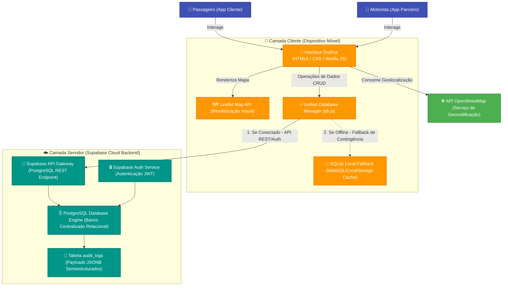

# RELATÓRIO TÉCNICO: PROJETO DE ARQUITETURA E ESTRATÉGIA DE DADOS
## Projeto TCC: AppEntrega (Premium Ride-Sharing Application)
### Disciplina: Banco de Dados III — Avaliação B2

---

## Introdução
Este documento apresenta a caracterização, a arquitetura e as estratégias de persistência, desempenho e concorrência propostas para o **AppEntrega**, um aplicativo de transporte de passageiros (ride-sharing) desenvolvido como projeto de TCC. O sistema adota uma arquitetura de banco de dados híbrida e altamente resiliente, combinando o poder do banco de dados relacional distribuído **Supabase Cloud (PostgreSQL)** com a resiliência local offline do **SQLite (dispositivo móvel)**, orquestrados de forma transparente através do componente unificado `UnifiedDatabaseManager`.

---

## Parte 1 — Caracterização dos Dados (30 pontos)

Para garantir alta disponibilidade, consistência transacional e resiliência offline, os dados tratados no ecossistema do **AppEntrega** foram caracterizados conforme sua taxonomia estrutural, origem, periodicidade operacional e estimativa volumétrica de produção a longo prazo.

### 1.1 Tipos de Dados Armazenados
O sistema armazena cinco domínios fundamentais de dados:
1. **Usuários (Users):** Dados cadastrais básicos, e-mail de login, número de telefone e link do avatar de perfil.
2. **Corridas (Rides):** Endereço de destino, data da solicitação, preço cobrado, identificador de motorista, status da viagem (ex: *solicitada*, *em andamento*, *concluída*).
3. **Cartões de Crédito (Cards):** Métodos de pagamento salvos pelo passageiro (bandeira, máscara do número, nome impresso, validade).
4. **Lugares Salvos (Places):** Endereços recorrentes marcados pelo usuário (ex: *Casa*, *Trabalho*) acompanhados das coordenadas geográficas para roteamento preciso.
5. **Logs de Auditoria (Audit Logs):** Registros contínuos de atividades de segurança, tentativas de autenticação e fluxos transacionais internos da aplicação.

### 1.2 Volume Estimado (Projeção a Médio/Longo Prazo)
Considerando um cenário realista de produção para uma cidade média, estimando **10.000 usuários ativos mensais** ao longo de 1 ano de operação:
* **Usuários:** 10.000 registros (~500 B por registro) = **5 MB**
* **Métodos de Pagamento (Cards):** Média de 1.5 cartões por usuário = 15.000 registros (~300 B por registro) = **4.5 MB**
* **Locais Favoritos (Places):** Média de 2 locais por usuário = 20.000 registros (~400 B por registro) = **8 MB**
* **Histórico de Corridas (Rides):** Média de 5 corridas por usuário ao mês = 600.000 registros por ano (~400 B por registro) = **240 MB**
* **Logs de Auditoria:** Cerca de 300 logs por usuário ao ano (login, logout, buscas, corridas) = 3.000.000 registros (~450 B por registro) = **1.35 GB**
* **Espaço Total Estimado em Banco Estruturado:** **~1.6 GB** em 1 ano de operação.
*(Nota: Arquivos binários como imagens de avatar de perfil são armazenados em um CDN / Supabase Bucket Storage, ocupando cerca de 10 GB adicionais em disco de armazenamento de objetos).*

### 1.3 Frequência de Atualização (Operações de Escrita)
* **Cadastro e Atualização de Usuário/Cartões/Lugares:** Escrita **sob demanda** (baixa frequência).
* **Corridas (Rides):** Operações de escrita em **tempo real** no momento da solicitação, aceitação, atualização de posição pelo GPS e finalização.
* **Logs de Auditoria:** Escrita contínua em **tempo real** a cada requisição HTTP crítica ou chamada assíncrona de autenticação.

### 1.4 Origem dos Dados
* **Entradas do Usuário (Inputs):** Credenciais, dados de cartão de crédito e endereços fornecidos diretamente nos formulários da UI.
* **Sensores de Geolocalização:** Coordenadas GPS (latitude/longitude) do dispositivo móvel do passageiro e motorista geradas periodicamente.
* **APIs Externas:** Geocodificação reversa de endereços e mapa base consumidos diretamente do **OpenStreetMap API** (via biblioteca Leaflet).

### 1.5 Classificação Estrutural e Matriz de Mapeamento
Abaixo está apresentada a classificação estrutural de cada tipo de dado manipulado pela aplicação:

| Tipo de Dado | Exemplo Prático | Estrutura | Armazenamento Físico |
| :--- | :--- | :--- | :--- |
| **Usuários** | ID único (UUID), nome, e-mail, senha, telefone. | **Estruturado** | Tabela `public.users` (PostgreSQL / SQLite) |
| **Corridas** | ID da viagem, endereço, data, preço cobrado, status. | **Estruturado** | Tabela `public.rides` (PostgreSQL / SQLite) |
| **Cartões** | Bandeira, número mascarado, titular, validade. | **Estruturado** | Tabela `public.cards` (PostgreSQL / SQLite) |
| **Locais Salvos**| Tipo (casa/trabalho), título, endereço, latitude, longitude. | **Estruturado** | Tabela `public.places` (PostgreSQL / SQLite) |
| **Logs** | Categoria do log, timestamp, IP, payload em formato JSON. | **Semiestruturado** | Tabela `public.audit_logs` (Campo `payload` tipo `JSONB` no PostgreSQL) |
| **Arquivos/Fotos**| Imagens de avatar de perfil enviadas pelos usuários. | **Não estruturado**| Supabase Storage (Object Storage / CDN) |

---

## Parte 2 — Escolha da Arquitetura de Dados (35 pontos)

### 2.1 Ecossistema de Banco de Dados Adotado
Para o **AppEntrega**, foi escolhida e implementada uma **Arquitetura Híbrida de Dados**, operando em dois níveis perfeitamente integrados:

1. **Nível Cloud (Banco de Dados Principal):** **Supabase Cloud (PostgreSQL)**. Um banco relacional, robusto e totalmente gerenciado, utilizado para persistência centralizada de todas as contas, auditoria, faturamento e histórico unificado de corridas.
2. **Nível Client (Persistência e Fallback Local):** **SQLite Local (WebSQL / LocalStorage)** integrado no contêiner Capacitor. Utilizado como cache local de desempenho e fallback resiliente offline, permitindo o funcionamento ininterrupto do aplicativo móvel mesmo em cenários de perda total de sinal de internet.

### 2.2 Justificativa Técnica para a Escolha do Cenário do TCC
Um aplicativo de transporte (ride-sharing) lida diretamente com **transações financeiras (faturamento de cartões)** e **deslocamento físico crítico**. 
* **Consistência Relacional e Transacional:** O uso do PostgreSQL na nuvem garante conformidade total com as propriedades ACID. É inadmissível que ocorram perdas de dados ou leituras sujas em cobranças de corridas ou credenciais de usuários. Chaves estrangeiras (`Foreign Keys`) garantem a integridade referencial entre usuários, cartões, lugares e corridas.
* **Resiliência de Rede Mobile (SQLite Offline Fallback):** Conexões móveis oscilam constantemente nas ruas. Caso a conexão com a nuvem caia, a classe unificada `UnifiedDatabaseManager` detecta automaticamente a falha de conexão e chaveia de forma transparente para o SQLite local, garantindo que o passageiro consiga navegar pela interface, ver dados cacheados e não sofra travamentos (crash) da UI.

### 2.3 Vantagens Operacionais Esperadas
* **Abstração Transparente:** O front-end da aplicação não sabe se está gravando na nuvem ou localmente; o método `window.dbManager` abstrai essa lógica de forma transparente, elevando a manutenibilidade do código.
* **Segurança Integrada out-of-the-box:** Autenticação robusta integrada no Supabase Auth, criptografando as credenciais no lado do servidor com algoritmos de alto nível.
* **Velocidade de Consulta (Latência Ultra-baixa):** Leituras locais de endereços salvos e preferências através do SQLite local oferecem respostas instantâneas na UI (sub-milissegundos).

### 2.4 Limitações Técnicas Identificadas
* **Sincronização Bidirecional Complexa (Split-Brain):** Resolver conflitos de escrita que ocorrem offline no SQLite quando a internet retorna exige algoritmos complexos de reconciliação de dados (estratégias como *Last Write Wins* ou carimbos de data/hora de controle).
* **Limitação Física de Storage Local:** A cota máxima do navegador móvel (ou WebView) para LocalStorage/WebSQL gira em torno de 5 MB a 50 MB, impossibilitando guardar o histórico completo de logs ou fotos de corridas indefinidamente no dispositivo do usuário.

---

## Parte 3 — Concorrência e Desempenho (20 pontos)

### 3.1 Mapeamento dos Cenários Críticos de Uso sob Carga
1. **Picos de Acessos Simultâneos (Horários de Pico):** Milhares de passageiros abrindo o app ao mesmo tempo em um dia de chuva forte, disparando requisições repetitivas de cálculo de preço de rotas e consulta de motoristas livres.
2. **Conflitos de Atualizações Concorrentes (Double Acceptance):** Dois motoristas clicando simultaneamente para aceitar a mesma corrida que apareceu na tela. Se não houver controle de concorrência, o banco pode atribuir o mesmo ID de corrida a ambos, gerando inconsistência operacional severa.
3. **Persistência de Registros Duplicados (Double Submit):** Um passageiro com sinal de rede lento clica seguidas vezes no botão "Confirmar Viagem" devido à aparente falta de resposta da UI. O sistema corre o risco de criar 3 solicitações de corrida idênticas e gerar 3 cobranças no cartão de crédito do cliente.
4. **Gargalo de I/O em Gravação de Logs:** Gravar logs de auditoria detalhados (cada busca de endereço, clique, movimentação no mapa) diretamente no disco rígido do banco relacional principal pode sobrecarregar o motor de escrita do PostgreSQL, lentificando consultas vitais dos usuários.

### 3.2 Soluções Estruturais e Conceituais Propostas

#### A. Mecanismos de Transações e Níveis de Isolamento (ACID)
Para operações de alta criticalidade, como faturamento e confirmação de corrida, as queries no banco Supabase são englobadas sob transações estritas. O nível de isolamento adotado nas tabelas transacionais é o **`REPEATABLE READ`** ou **`SERIALIZABLE`**. Isso garante que leituras fantasmas e atualizações concorrentes inconsistentes sejam bloqueadas nativamente no PostgreSQL antes de afetar o saldo ou a integridade dos dados.

#### B. Políticas de Locks (Bloqueios) contra Conflitos de Aceitação
Para mitigar o cenário crítico de dois motoristas aceitando a mesma corrida, adota-se o **Lock Otimista (Optimistic Locking)** utilizando uma coluna de controle de versão (ex: `version_id` ou `updated_at`) na tabela de corridas, ou o **Lock Pessimista (Pessimistic Locking)** no PostgreSQL executando a cláusula `SELECT FOR UPDATE` ao ler o status da corrida para aceitação:
```sql
-- Lock Pessimista garantindo exclusividade de escrita no PostgreSQL
BEGIN;
SELECT status, driver_id FROM public.rides WHERE id = 12345 FOR UPDATE;
-- Se status = 'requested', atualiza para 'accepted' e atribui o motorista
UPDATE public.rides SET driver_id = 'uuid-motorista', status = 'accepted' WHERE id = 12345;
COMMIT;
```
Essa abordagem garante que o primeiro motorista bloqueie a linha no banco, forçando a transação do segundo motorista a esperar e subsequentemente falhar de forma segura informando que "a corrida já foi aceita".

#### C. Filas de Mensageria e Processamento Assíncrono
Para suportar picos extremos de demanda e evitar que o banco de dados operacional seja o gargalo, as solicitações de corrida são despachadas para uma **Fila de Mensageria Assíncrona** (como Redis Streams ou RabbitMQ). O servidor back-end consome as solicitações da fila em um fluxo controlado de escrita, desacoplando a resposta instantânea da UI da inserção física síncrona no PostgreSQL.

#### D. Camada de Cache em Memória (Redis)
Utilização de um banco de dados em memória **Redis** para atuar como cache ultra-rápido de dados dinâmicos e temporais:
* **Coordenadas de Motoristas:** As posições geográficas em tempo real dos motoristas são atualizadas diretamente no Redis a cada 5 segundos utilizando estruturas de dados geoespaciais (`GEOADD`). Evita-se, assim, milhões de escritas em disco rígido no PostgreSQL.
* **Cálculo de Rotas Recorrentes:** Cache de preços calculados recentemente para rotas populares, evitando recálculos caros no banco operacional.

#### E. Estratégias Gerais de Escalabilidade
* **Escalabilidade Vertical:** Inicialização do banco em nuvem com provisionamento otimizado de CPU e memória RAM no Supabase para suportar taxas maiores de transações por segundo (TPS).
* **Escalabilidade Horizontal (Réplicas de Leitura):** Divisão de carga do PostgreSQL. Todas as operações de leitura (histórico de corridas antigas dos usuários, locais salvos, relatórios) são redirecionadas para instâncias secundárias de réplicas de leitura (Read Replicas), liberando a instância master exclusivamente para escritas críticas.
* **Particionamento de Tabelas (Table Partitioning):** A tabela de histórico de corridas (`rides`) é particionada por mês ou ano de criação, mantendo as tabelas ativas pequenas e rápidas.

---

## Parte 4 — Proposta Visual (15 pontos)

O diagrama macro a seguir ilustra o fluxo principal das informações da solução híbrida do **AppEntrega**, mapeando a interação dos usuários com as camadas de aplicação, as instâncias de banco envolvidas (local e nuvem) e integrações de terceiros via Mermaid:



---

## Parte 5 — Conclusão e Diferencial Técnico (Bônus até +10 pontos)

Para comprovar a viabilidade física e prática da arquitetura proposta, o grupo apresenta duas evidências reais de implementação conectadas e implantadas no repositório de TCC:

### Evidência 1: Protótipo Funcional do Banco de Dados (Scripts DDL/DML estruturados)
Foi criado e anexado ao repositório o arquivo [schema.sql](file:///c:/Users/boave/Downloads/TCC%20proj/TCC%20Proj/schema.sql) contendo a estrutura real PostgreSQL DDL e DML de seeding para testes. A modelagem inclui:
* Restrições de integridade referencial (`FOREIGN KEY` e `ON DELETE CASCADE`) para garantir a consistência das tabelas relacionais vinculadas ao usuário.
* Índices de desempenho (`CREATE INDEX`) criados nas chaves estrangeiras (`user_id`) para evitar gargalos de I/O em consultas de histórico de corridas e cartões.
* Regras de validação estritas (`CHECK constraints`) nas colunas críticas (`status` e `is_default`).

### Evidência 2: Geração e Estruturação Prática de Logs da Aplicação (Semiestruturado)
Para demonstrar o tratamento prático de logs sob conceitos modernos de BD III, foi desenvolvido o script executável em Node.js [generate_logs.js](file:///c:/Users/boave/Downloads/TCC%20proj/TCC%20Proj/generate_logs.js) localizado no diretório principal.
* O script gera e estrutura em formato **semiestruturado (JSON)** logs de auditoria e transações contendo payloads flexíveis específicos para cada tipo de evento (login bem-sucedido ou falho, adição de cartões, pedidos de corridas geocodificados).
* Os dados gerados são compatíveis para inserção direta na coluna `payload JSONB` da tabela `audit_logs` do PostgreSQL, oferecendo flexibilidade de buscas dinâmicas sem a necessidade de alterações físicas constantes no esquema do banco.
