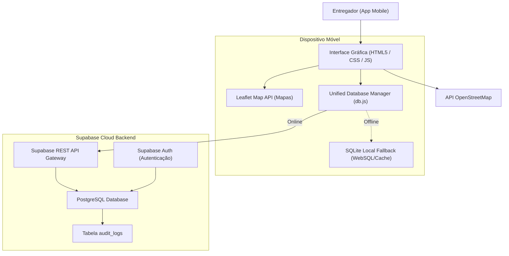

# AppEntrega

O AppEntrega é uma aplicação híbrida voltada para a roteirização e apoio logístico de entregadores. Desenvolvido como Trabalho de Conclusão de Curso (TCC), o projeto visa resolver problemas práticos de mobilidade e conectividade enfrentados por profissionais de entrega no cotidiano urbano, oferecendo planejamento de trajetos, um canal de oportunidades de fretes e um sistema de auxílio emergencial local.

## Funcionalidades Principais

* **Planejamento e Roteirização:** Integração com mapas interativos para cálculo e visualização de trajetos eficientes.
* **Portal de Oportunidades:** Espaço integrado para consulta de fretes e ofertas de serviços de entrega na região de atuação do profissional.
* **Assistência Emergencial (SOS):** Canal direto para localização e contato com serviços mecânicos e borracheiros próximos em caso de imprevistos na rota.
* **Operação Offline:** Acesso contínuo aos dados de rotas e contatos úteis mesmo em áreas sem cobertura de internet.

## Arquitetura de Dados

A arquitetura do sistema foi projetada para garantir alta disponibilidade e tolerância a falhas de conexão, utilizando uma abordagem híbrida de persistência:

1. **Persistência Centralizada (Nuvem):** Utilização do Supabase (PostgreSQL) para armazenamento global de perfis de entregadores, histórico de rotas finalizadas, pontos de referência e auditoria do sistema.
2. **Persistência Local (Dispositivo):** Utilização de banco de dados SQLite embarcado por meio do contêiner Capacitor. Atua como cache local e banco de contingência para viabilizar o uso offline.

O controle e a alternância entre os modos online e offline são realizados de forma transparente pela camada de abstração unificada localizada em `www/db.js` (`UnifiedDatabaseManager`), assegurando que a interface do usuário não sofra interrupções durante oscilações de rede.

### Fluxo de Integração de Dados



## Engenharia de Banco de Dados e Concorrência

Para assegurar a integridade dos dados e o desempenho do sistema sob concorrência, foram aplicadas técnicas específicas no nível de banco de dados:

### Controle de Concorrência
Nas operações de atualização do status de entrega ou atribuição de lotes de rotas, o sistema adota o bloqueio pessimista (*pessimistic locking*) via instrução `SELECT FOR UPDATE` no PostgreSQL. Isso evita conflitos em que múltiplos usuários tentem manipular o mesmo registro simultaneamente.

### Níveis de Isolamento
As atualizações de dados sensíveis e históricos de rotas utilizam o nível de isolamento transacional `REPEATABLE READ`, mitigando problemas decorrentes de leituras fantasmas e garantindo a consistência das transações.

### Telemetria e Auditoria Semiestruturada
A tabela de auditoria (`audit_logs`) emprega o tipo de dado `JSONB` no PostgreSQL. Essa abordagem simplifica o registro de eventos de segurança e payloads geográficos com estruturas dinâmicas, eliminando a necessidade de alterações físicas constantes no esquema do banco e otimizando o desempenho de consultas indexadas.

## Estrutura do Banco de Dados

A modelagem lógica do banco de dados contempla as seguintes tabelas principais:
* `users`: Cadastro e autenticação dos entregadores.
* `rides`: Registro de trajetos executados e histórico de rotas de entrega.
* `places`: Armazenamento de endereços frequentes e pontos de coleta/apoio logístico.
* `cards`: Cadastro auxiliar associado a métodos de pagamento ou créditos no sistema.
* `audit_logs`: Registro de eventos de segurança e logs operacionais em formato semiestruturado.

O script DDL completo, com a definição de chaves estrangeiras, restrições e índices de desempenho (como `idx_rides_user_id`), está localizado no arquivo `schema.sql`.

## Tecnologias Utilizadas

### Front-end e Mobile
* **Capacitor v8:** Encapsulamento nativo para plataforma Android.
* **Vanilla JavaScript (ES6):** Desenvolvimento de interface leve e responsiva sem a necessidade de frameworks externos.
* **Leaflet e OpenStreetMap:** Renderização de mapas e processamento de coordenadas geográficas.
* **SQLite (WebSQL / LocalStorage Fallback):** Armazenamento local estruturado.

### Back-end e Nuvem
* **Supabase Cloud:** Provedor do banco de dados relacional PostgreSQL, infraestrutura de autenticação e geração automática de endpoints REST.
* **Node.js:** Ambiente para scripts auxiliares.

## Instruções para Execução Local

### Pré-requisitos
* Node.js instalado na máquina.
* Android Studio (necessário caso queira gerar e compilar o pacote nativo `.apk`).

### Passos para Instalação

1. Clone o repositório para sua máquina local:
   ```bash
   git clone https://github.com/seu-usuario/app-entrega.git
   cd app-entrega
   ```

2. Instale as dependências do projeto:
   ```bash
   npm install
   ```

3. Configure as variáveis de acesso ao Supabase no arquivo `www/supabase-config.js`:
   ```javascript
   window.SUPABASE_URL = 'SUA_SUPABASE_URL';
   window.SUPABASE_ANON_KEY = 'SUA_SUPABASE_ANON_KEY';
   ```

4. Sincronize e compile a aplicação:
   ```bash
   npx cap sync
   npx cap open android
   ```

## Licença

Este projeto é de uso acadêmico, desenvolvido sob licença ISC.
